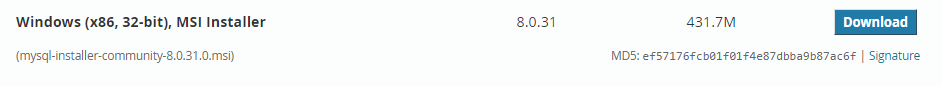

#This file contains all the requirements for Robot Framework Python and selenium.

1. Download Python latest version:
   https://www.python.org/downloads/

2.  Install Python:
    If python is installed and environment variable are set.

    Then open command prompt.
    Run the following commands.
    ==> python –-version
    ==> pip --version

3.  Install Selenium:
    Install selenium using command prompt.
    pip install robotframework
    Then after installation run this command.
    robot -–version
    rebot –version
    pip show robotframework

4.  Install Pycharm
    Download pycharm community version and install it.
    https://www.jetbrains.com/pycharm/download/#section=windows

    Then launch and create project:
    Then navigate to setting and add these libraries:
    Then in settings click on Python Interpreter.
    Then click on + button to add libraries.
    Install and add “Selenium”.
    Install and add RobotFramework
    Install and add RobotFramework-seleniumlibrary
    Install and add PyMySQL
    Install and add RobotFramework-Databaselibrary

5.  Check your chrome webdriver version and download it using chrome, then after extracting place chromedriver.exe file in the following path as per your system script folder:
    
        C:\Users\Farasat Aziz\AppData\Local\Programs\Python\Python310\Scripts

6.  Also, download plugin from this git repository, using this link:

    Intellibot Plugin For Pycharm
    https://github.com/lte2000/intellibot/blob/master/intellibot.jar

    Note: The pycharm intellibot plugin of Robot Framework is not upto date. That’s why
    download intellibot plugin for Robot Framework using the above repository.
 
    Then install intellijbot plugin from laptop.
    Then save project and relaunch pycharm.

7.  To implement allunore reporting run the following command using command line:
       
          pip install allure-robotframework
          pip install robotframework-allure

8.  And in my robot script I have the following statement:
    
          Library AllureReportingLibrary
    
9.  I am running the following command in cmd line to run robot file:
        
          robot --listener allure_robotframework ./TestCases/InnovationFoamTestCases.robot

10. To run allunore generated, implement the following the command:

         allure serve ./output  

11. To run requirement.txt file run this command:
    
        pip install -r requirement.txt

12. Check your chrome webdriver version and download it using chrome, then after extracting place chromedriver.exe file in the following path as per your system script folder:
    
        C:\Users\Farasat Aziz\AppData\Local\Programs\Python\Python310\Scripts

13. To run test in parallel download and install selenium pabot library:
 
        pabot --processes 2 .\TestCases\*.robot
14.  To run test in database testcases file:

        First download and install mysql installer file form the following link:
        https://dev.mysql.com/downloads/installer/
        
        
        Then install mysql server and mysql Workbench using mysql installer.
        Then after launching mysql Workbench. 
        Create connection by clicking on + icon using:
        
         Connection name: mydb 
         Root password: root
        
        Then to run database testing file run the following command:
        
         robot .\TestCases\DBTesting.robot

